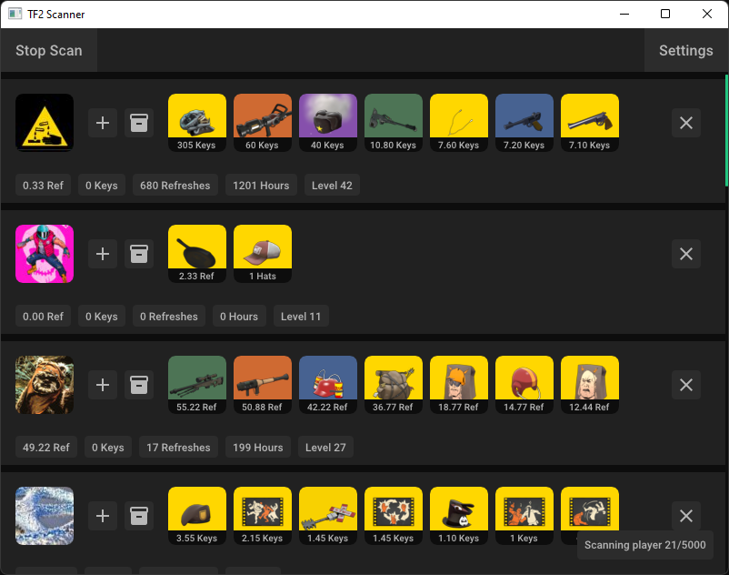

# Sadly Steam crippled this scanner in an update to the inventory API a few months ago.
You will still be able to scan but at a really slow rate (1 user per few minutes)

# TF2 Scanner
## [Download here](https://github.com/AleXu224/tf2-scanner/releases/latest)

An easy to use TF2 inventory scanner.
Supports steamids, server statuses and even group links with a variety of filters to help with your trading.

# Usage
- Download the latest version of the program from [here](https://github.com/AleXu224/tf2-scanner/releases/latest)
- Extract the prgram anywhere in your pc
- Open the program and input your [api key](https://steamcommunity.com/dev/apikey) on prompt
- Press the "Settings" button to change the scan settings and input your steamids/server status/group link and start scanning

## Why does the scanner need my api key?
The scanner requires your api key in order to get player summaries (basic player info like name, avatar, visibility, etc.), player levels and the item schema (information about items that the program requires to properly identify them).

## Contact
If you encounter a bug or wanna request a feature you can contact me on [Steam](http://steamcommunity.com/id/Squizell/) or Discord at Squizel#7200
